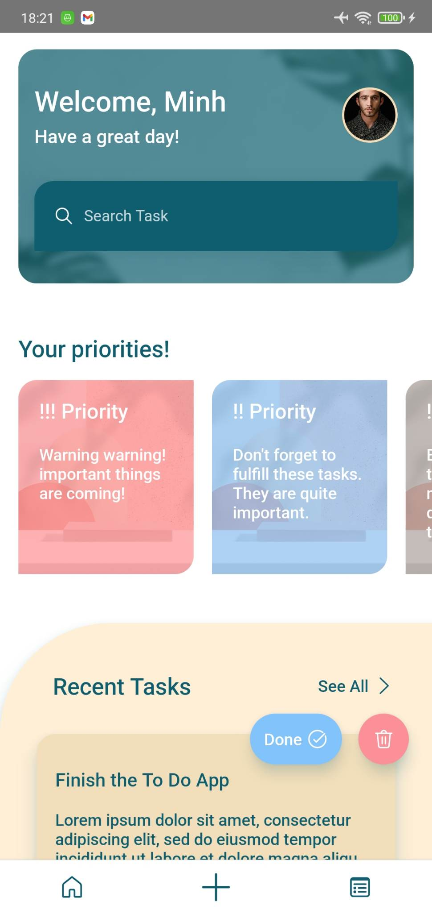
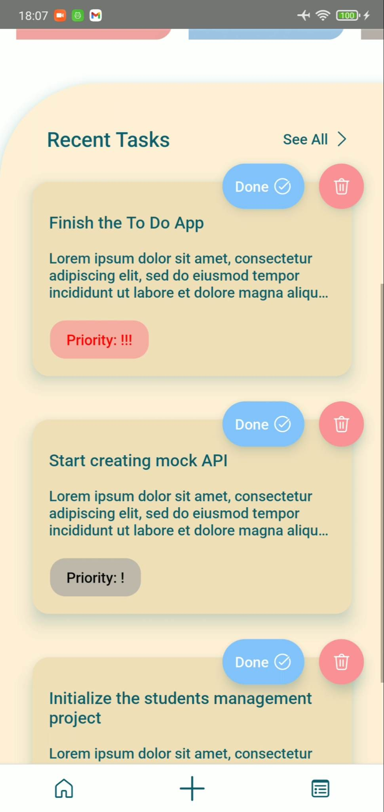
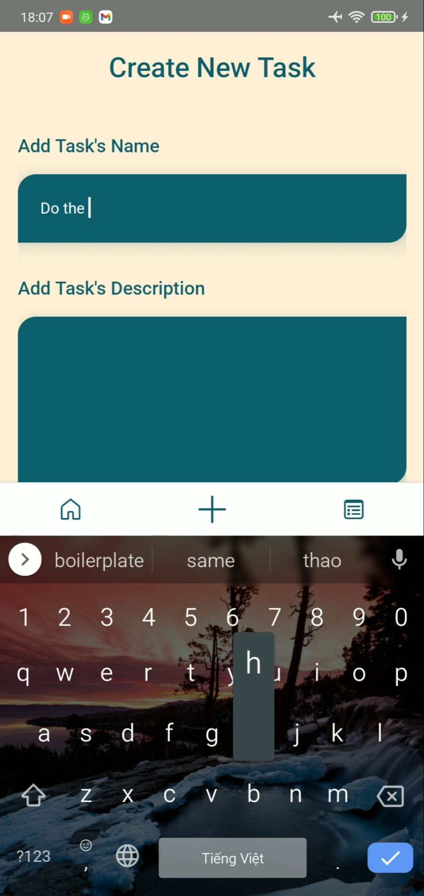
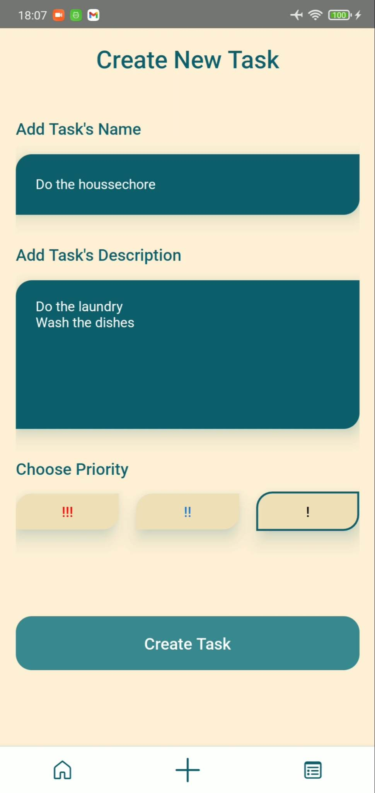
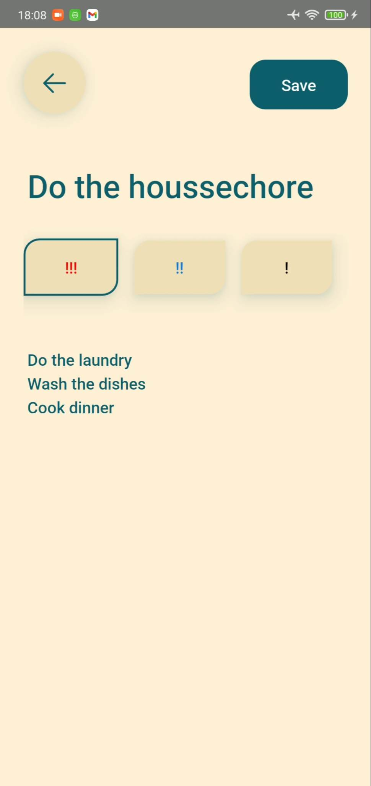
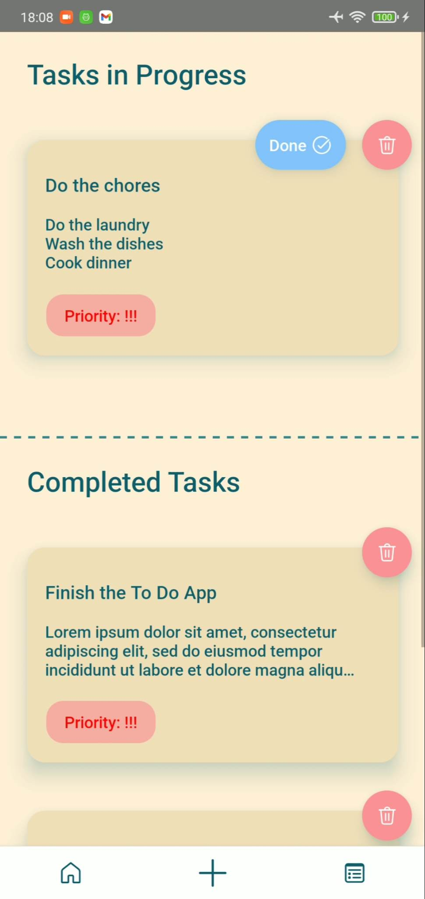
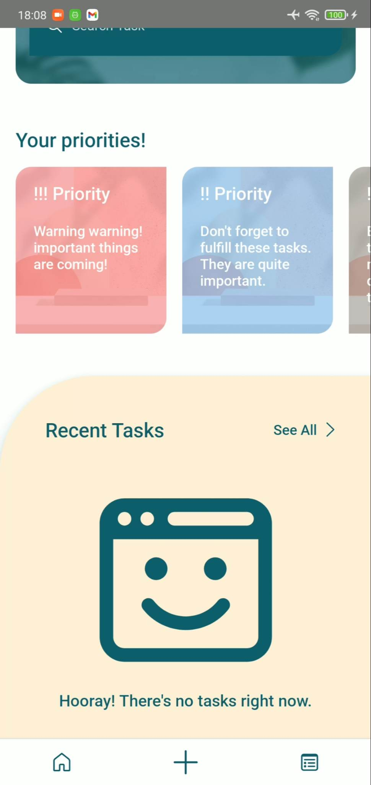

# react-native-todo
This is a Todo List app written using React Native for learning purpose. In this particular project I have learned how to write styles for the UI properly and manage states using Redux Toolkit quite comfortably.

Starting from the Home Screen (I haven't had enough time for some fancy things like splash screens or animations ^^), we have a welcome section where users are likely to see their name, a greeting and their avatars.

Below we have a search bar which is still in development. This is an important feature which I really want to develop in the future.

The next section is the priorities list section, where users can tap on a priority card from a horizontal flat list to be navigated to the TaskList screen with appropriate priority filtered.
I plan to combine this feature with the search feature together, they can be developed when I have more time in the future. Right now it's just a static list with no functionalities.

Last but not least, we go to the hero of the screen - the RecentTaskList. People are likely to view their recent created tasks here in each individual TaskCard.
Each card contains the title, the description and the priority of the task as well as some call-to-action like the deletion and the completion buttons.

When we tap on the plus icon on the bottom tab bar, we will be navigated to the CreateTask screen. Users can see some inputs to write their task's name and description, as well as some
priority options for them to choose. Please note that there's a pretty simple validation when users try to create the task when there's no task's name.
A simple error message will appear above the button. After creating a new task, new data will be added to the tasks list in the Redux store and users will be navigated back to the 
Home Screen.

 

When users tap on a particular Task Card, they will be navigated to the TaskDetail screen. Here they can view the task's information.
Users can tap on the information to edit their task. If there is any changes, the system will recognize and show a save button. 
If users tap on this button, new data will be passed to the store to update the task, then users will be navigated back to the Home Screen.

The last screen is the Task List screen. Users are likely to view all their tasks here. The tasks will be divided into 2 parts: in progress and completes. 
Also, if users tap on the delete icon on top right corner of the card, the task will be removed. I will try to prompt a notification to users if they really want to delete the task.

Finally, if the tasks list is empty, a friendly face will appear to notify users ^^

Hope you like my project ^^ there are a large amount of functionalities that I still want to develop. Please stay tuned!!
